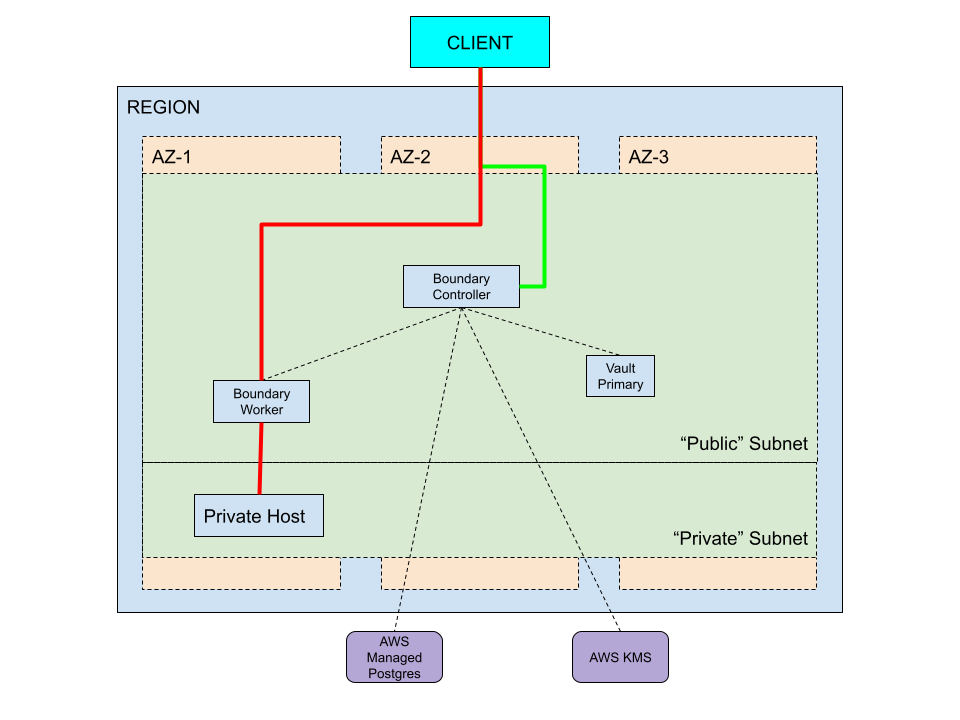

# Boundary Deployment Examples
This directory contains two deployment examples for Boundary using Terraform. The `terraform/aws` directory contains an example AWS reference architecture codified in Terraform. The `terraform/boundary` directory contains an example Terraform configuration for Boundary using the [Boundary Terraform Provider](https://github.com/hashicorp/terraform-provider-boundary).

## Reference


## Requirements
- Terraform 0.13
- Packer v1.7.5+

## Prerequisities
- AWS Credentials to:
  - create VPCs
  - create Subnets
  - instantiate EC2 VMs
  - create Load Balancer Resources
  - create RDS Postgres DB
  - create keys in KMS
- AWS Credentials exported to you CLI

## Deploy
To deploy this example:
- In the `packer` directory, run

```
packer build -var "unique_name=<YOUR NAME>" - var "boundary_version=0.7.1" aws-boundary.pkr.hcl
```

```
packer build -var="vault_version=1.9.0" -var="unique_name=<YOUR NAME>" aws-vault.pkr.hcl
```

- In the `terraform` directory, run 

```
terraform apply
```

If your public SSH key you want to SSH to these hosts are not located at `~/.ssh/id_rsa.pub` then you'll also need to override that value:
```
terraform apply -target module.aws -var pub_ssh_key_path=<path to your SSH public key>
```

If the private key is not named the same as the public key but without the .pub suffix and/or is not stored in the same directory, you can use the `priv_ssh_key_path` variable also to point to its location; otherwise its filename will be inferred from the filename of the public key.

## Verify
- Once your AWS infra is live, you can SSH to your workers and controllers and see their configuration:
  - `ssh ubuntu@<controller-ip>`
  - `sudo systemctl status boundary-controller`
  - For workers, the systemd unit is called `boundary-worker`
  - The admin console will be available at `https://boundary-test-controller-<random_name>-<random_sha>.elb.us-east-1.amazonaws.com:9200`

## Configure Boundary 
- Configure boundary using `terraform apply` (without the target flag), this will configure boundary per `boundary/main.tf`

## Login
- Open the console in a browser and login to the instance using one of the `backend_users` defined in the main.tf (or, if you saved the output from deploying the aws module, use the output from the init script for the default username/password)
- Find your org, then project, then targets. Save the ID of the target. 
- Find your auth methods, and save the auth method ID.
- Login on the CLI: 

```
BOUNDARY_ADDR='https://boundary-test-controller-<random_name>-<some sha>.elb.us-east-1.amazonaws.com:9200' \
  boundary authenticate password \
  -login-name=jim \
  -password foofoofoo \
  -auth-method-id=ampw_<some ID>
```

You can also use this login name in the Boundary console that you navigated to in the verify step.

## Connect

Connect to the target in the private subnet via Boundary:

```
BOUNDARY_ADDR='http://boundary-test-controller-<random_name>-<sha>.elb.us-east-1.amazonaws.com:9200' \
  boundary connect ssh --username ubuntu -target-id ttcp_<generated_id>
```
